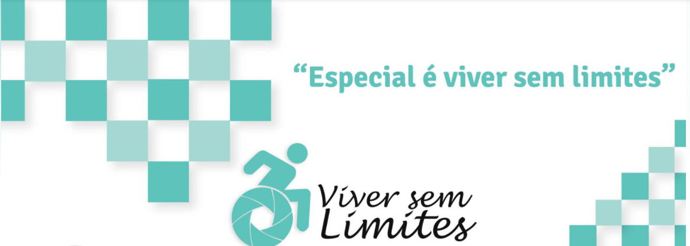
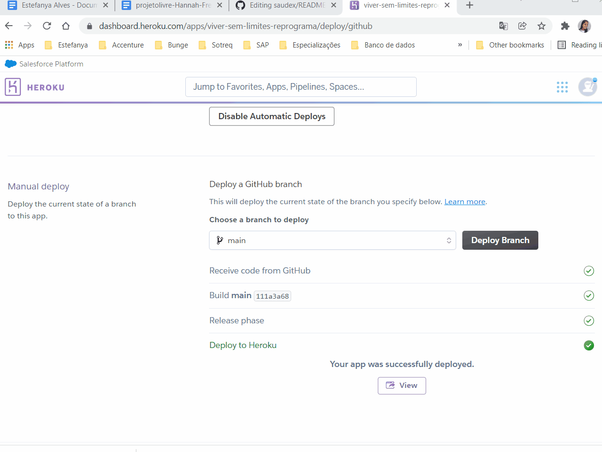

```
 Bootcamp - Todas em Tech, turma 14° de Backend.
```

<h1 align="center">
    <br>
    <p align="center">Projeto Final {Reprograma}💜<p>
</h1>
<p align="center">

</p>
<br>


## <strong> Viver sem limites </strong> é um projeto - API, que foi desenvolvido para a conclusão do curso de Backend [{Reprograma}](https://reprograma.com.br/).


## 💜O PROJETO FINAL

<p align="justify"> É uma iniciativa para ajudar  pessoas que precisam de muletas, andadores, cadeiras de rodas e equipamentos afins, mas não tem recursos para comprar estes equipamentos,  assim esta API vai unir quem tem itens disponíveis para doação com quem está precisando deles no momento.
<p align="justify"> Desenvolver um aplicativo que conecta quem doa com quem precisa. O aplicativo armazena as informações de quem oferece itens para doar e de quem precisa deles para criar um banco de dados em que seja possível cruzar esses interesses, sem a necessidade de armazenar os itens. 


<br>

## 💜Descrição da API - VIVER SEM LIMITES


<p align="justify"> De acordo com o último senso do IBGE 46 milhões de brasileiros, cerca de 24% da população, tem algum grau de dificuldade em pelo menos uma das habilidades investigadas (enxergar, ouvir, caminhar ou subir degraus), ou possuir deficiência mental / intelectual.  A grande maioria de hospitais e clinicas só tem o modelo convencioanl de cadeiras de rodas que é destinado para o atendimento de mergencia para pessoas com mobilidade reduzida e paraplégicos.

Apesar do plano nacional "Viver sem limites" para consegui uma cadeira motorizada pelo SUS por exemplo pode demorar alguns meses, em alguns casos é preciso recorrer a justiça, que torno o processo ainda mais lento.

Pensando nesta demora do SUS uma ação mais rápida e funcional foi a criação de uma API com o mesmo nome do programa Viver sem limites, onde pessoas com equipamentos para deificientes e que desejam doar possa fazer isso sem custo. No futuro contato entre doadores e receptores sem muita burocracia. 

<p align="justify">A construção deste projeto consiste em uma API RESTFull fundamentada no CRUD, integrado com o banco de dados NoSQL, sendo possível listar, cadastrar, atualizar e deletar cadastros dos doadores de equipamentos para deficientes.

- Definição CRUD: 
    
      CREATE (CRIAR)
      READ (LER, CONSULTAR)
      UPDATE (ATUALIZAR) 
      DELETE (DESTRUIÇÃO, REMOÇÃO)


<br>

<br>

## 💜Funcionalidades

- Incentivar a doação de itens que estejam em bom estado e possa ser usado por outras pessoas com as mesmas condições de deficiência
- Listar todas as pessoas que estão cadastradas no sistema
- Cadastrar itens e doadores
- Atualizar lista de doadores e equipamentos disponíveis
- Deletar os itens já doados que não estão mais disponíveis

  

<br>

## 💜Tecnologias Utilizadas

Para a construção deste projeto, as seguintes tecnologias foram utilizadas:

<p  align="justify">
<a  href="https://www.javascript.com/">

<a  href="https://git-scm.com/">
<a  href="https://nodejs.org/pt-br/">
<a  href="https://www.mongodb.com/cloud/atlas">
<a  href="https://www.postman.com/">
<a  href="https://code.visualstudio.com/">
<a  href="https://dashboard.heroku.com/apps">


<br>

## 💜Bibliotecas Aplicadas
Para a construção deste projeto, as seguintes bibliotecas foram aplicadas:

<p  align="justify">
<a  href="https://expressjs.com/pt-br/">
<a  href="https://www.npmjs.com/package/nodemon">
<a  href="https://www.npmjs.com/package/dotenv-safe">
<a  href="https://mongoosejs.com/">
<a  href="https://www.npmjs.com/package/cors">
<a  href="https://www.npmjs.com/">

</p>


<br>

## 💜Arquitetura MVC
Arquitetura padrão da API Viver sem limites:
```
 📁 VIVER SEM LIMITES
   |
   |-  📁 assets
   |    |- 📑 img.png
   |
   |-  📁 src
   |    |
   |    |- 📁 controllers
   |         |- 📑 doador.js
   |
   |    |- 📁 database
   |         |- 📑 Config.js
   |
   |  
   |    |- 📁 models
   |         |- 📑 doadorSchema.js
   |
   |    |- 📁 routes
   |         |- 📑 doadorRouter.js 
   |         |- 📑 index.js
  
   |    |- 📑 app.js

   |- 📑 .env
   |- 📑 .env.example
   |- 📑 .gitignore
   |- 📑 package-lock.json
   |- 📑 package.json
   |- 📑 Procfile
   |- 📑 README.md
   |- 📑 server.js

```
<br>

## 💜Para rodar o projeto localmente

Faça instalação desta API, siga o passo a passo conforme abaixo:


- No terminal Git Bash Here, faça o clone da API VIVER SEM LIMITES:

      git clone https://github.com/EstefanyaNascimento/Viver-sem-limites-Reprograma

Siga os passos e inclua as informações abaixo:

| Passo     | Comando/informação       |
| --------- | ----------- |
| Faça o fork  | `botão de forkar` |
| Faça o clone  | `git clone` |
| Instale as dependências   | `npm i` |
| Crie seu .env e inclua as variáveis e os valores     | `MONGODB_URL` |
| utilize o script de dev    | `npm dev` |

 MONGODB_URL = URL do `MongoDb Atlas` Banco de dados orientado a documentos e interface na nuvem.


<br>

## 💜Portas

### Opções de Portas

* Local: http://localhost:5558/ - (rodando localmente)

* Heroku: https://viver-sem-limites-reprograma.herokuapp.com - (consumir API)

* Utilize o [Postman](https://www.postman.com/) ou [Insomnia](https://insomnia.rest/download/) para chamar e testar os endpoints da API localmente ou via Heroku.

<br>

## 💜Rotas


| Método HTTP  | Tipo Rota | Endpoint                     | Descrição                            |
| ------------ | --------- | ---------------------------- | ------------------------------------ |
| GET          | Pública   | `http://localhost:5558/`     |  Mensagem de apresentação (Index)    |             

<br>

## 💜Manipulação das Rotas dos doadores:

| Método HTTP  | Tipo Rota | Endpoint                | Descrição                                            |
| ------------ | --------- | ----------------------- | -----------------------------------------------------|
| GET          | Pública   | `/doadores/all`         | Retorna todo os dados de todos os doadores                      |            |
| POST         | Pública   | `/doadores/create`      | Cadastra uma novo doador                          |
| PUT          | Pública   | `/doadores/update/:id`  | Altera informações de um doador específico por id |
| DELET        | Pública   | `/doadores/delete/:id`  | Remove um doador específico por id                |

<br>

<p p align="center"></img></p>


## 💜 Collections da API que deverá retornar o  seguinte JSON:

```jsx

{
    "message": "Cadastro atualizado com sucesso!",
    "savedPutDoador": {
        "_id": "61bb47149788a1902f3e7355",
        "doador": "Divaneide",
        "idade": "23",
        "equipamento": "Bengalas",
        "bairro": "caxias",
        "cidade": "Ibura",
        "telefone": "3232 - 3250",
        "pessoabeneficiada": " Nao declarada",
        "createdAt": "2021-12-16T14:03:00.264Z",
        "updatedAt": "2021-12-17T14:54:48.114Z",
        "__v": 0
    }
}

```
 <br>

## 💜 Projeto em Construção (Futuras melhorias)

<br>

*  Integrar com o Maps para calcular a distância do doador e receptor mais próximo.
*  Implantação de código HTML e CSS para criação de uma interface capaz de possibilitar a interação do usuário com aplicação;
*  Desenvolver rotas para o receptor e doador interagirem e otimizar as doaçãoes e recebimentos.

Toda sugestão de melhoria deste projeto será muito bem-vinda!!!

<br>

##  💜 Referências

<h3>

> <a href="https://blog.freedom.ind.br/doacao-cadeira-de-rodas-sus/">Doação de Cadeira de Rodas pelo SUS</p></a>

 > <a href="https://www.projetodraft.com/civida-oferece-doacao-de-muletas-cadeiras-de-rodas-e-outros-equipamentos/">Civida conecta pessoas</p></a>

 > <a href="https://www.universosenior.com/mobilidade/">Universo senior</p></a>


 > <a href="https://github.com/letidesi/saudex"><p align="">Inspiração para criação do Readme - Letícia Desidero</p></a>

  > <a href="https://github.com/Jhenial/Projeto_Final_Condominio_Recicla"><p align="">Inspiração para criação do Readme - Jenni </p></a> 

</h3>

<br>


<br>


## 💜 Autora

<br>


<td align="center"><a href="https://github.com/EstefanyaNascimento">
 </td><br> 


<br>


<br>

Vamos nos conectar!

  <div>
    <a href="https://www.linkedin.com/in/estefanya-alves/" target="_blank"></a>  
  <a href = "https://github.com/EstefanyaNascimento"></a>

 <br>

 <br> 

Feito com 💜 por Estefanya  Alves
<br>------------------------------------------------------------------------------------------<br>
  

<br>


